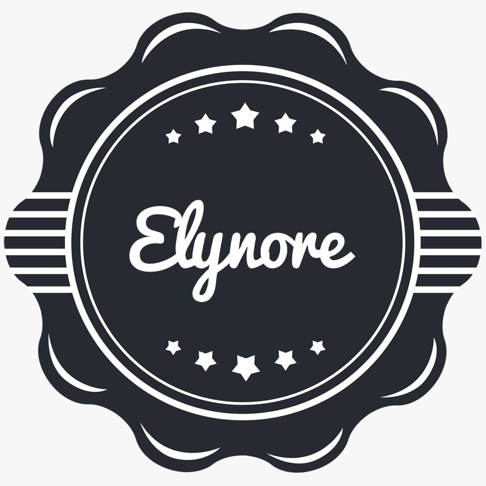

# elynore_web

IT / Software Company

<br />
<div align="center">
  <a href="https://github.com/Gtstride/elynore_web/edit/main/README.md">
    
  </a>

  <h3 align="center">Elynore Web-README</h3>
  
<details>
  <summary>Table of Contents</summary>
  <ol>
    <li>
      <a href="#about-the-project">About The Project</a>
      <ul>
        <li><a href="#built-with">Built With</a></li>
      </ul>
    </li>
    <li>
      <a href="#getting-started">Getting Started</a>
      <ul>
        <li><a href="#prerequisites">Prerequisites</a></li>
        <li><a href="#installation">Installation</a></li>
      </ul>
    </li>
    <li><a href="#usage">Usage</a></li>
    <li><a href="#roadmap">Roadmap</a></li>
  </ol>
</details>

<p align="right">(<a href="#top">back to top</a>)</p>

### Built With

This section should list any major frameworks/libraries used to bootstrap your project. Leave any add-ons/plugins for the acknowledgements section. Here are a few examples.

- [React.js](https://reactjs.org/)
- [Node.js](https://nodejs.org/)
- [Express](https://angular.io/)
- [Bootstrap](https://getbootstrap.com)
- [JQuery](https://jquery.com)

<p align="right">(<a href="#top">back to top</a>)</p>

## Getting Started

This is Elynore Web page.
To get a local copy up and running follow these simple example steps.

### Prerequisites

This is an example of how to list things you need to use the software and how to install them.

- npm
  ```sh
  npm install npm@latest -g
  ```

### Installation

1. Get a free API Key at [https://example.com](https://example.com)
2. Clone the repo
   ```sh
   git clone https://github.com/Gtstride/elynore_web.git
   ```
3. Install NPM packages
   ```sh
   npm install
   ```
4. Enter your API in `config.js`
   ```js
   const API_KEY = "ENTER YOUR API";
   ```

<p align="right">(<a href="#top">back to top</a>)</p>
